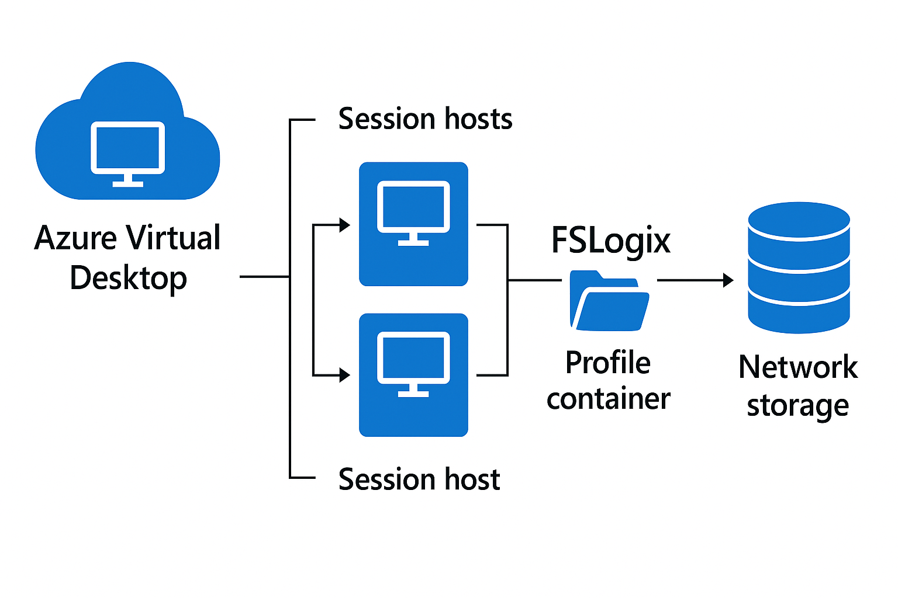

# FSLogix profile

An **FSLogix profile** is a user profile management solution used in **Azure Virtual Desktop (AVD)** and other virtual desktop environments. It helps provide a consistent and fast user experience by handling user profiles in a more efficient way than traditional roaming profiles.

### **Key Points About FSLogix Profiles**
- **Purpose**: FSLogix stores user profiles in a **VHD/VHDX container** on a network location (like Azure Files or an SMB share). When a user logs in, the container is mounted to the session host, making the profile appear local.
- **Benefits**:
  - **Fast logon times**: No need to copy the entire profile at logon/logoff.
  - **Consistency**: The same profile follows the user across multiple session hosts.
  - **Supports Office 365**: Handles Outlook OST files, OneDrive cache, Teams cache efficiently.
- **Components**:
  - **Profile Container**: Stores the entire user profile.
  - **Office Container**: Optimized for Office 365 data.
- **Integration**: Works with AVD, Citrix, VMware Horizon, and RDS.

