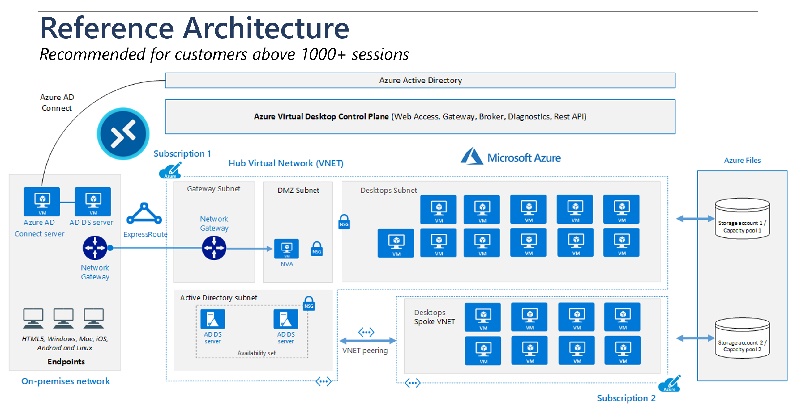
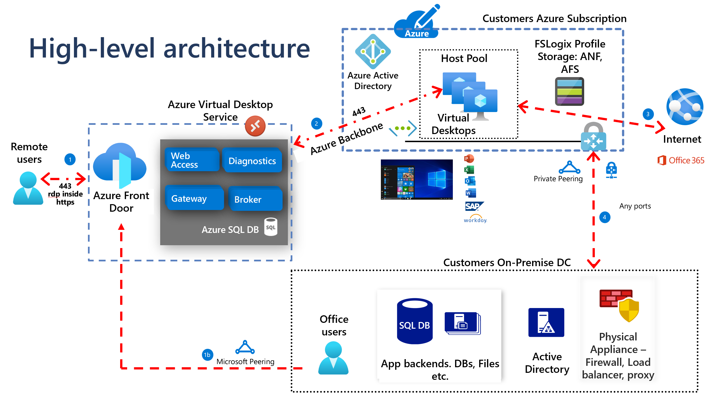

# Azure Virtual Desktop Solutions Workshop

## Workshop Overview

### Target Audience
- IT Administrators and Cloud Architects
- DevOps Engineers
- Solution Architects
- Decision makers evaluating virtual desktop solutions

### Duration
Full-day workshop (8 hours including breaks)

### Learning Objectives
By the end of this workshop, participants will be able to:
- Understand the key differences between Azure Virtual Desktop, Azure DevBox, Azure VMs, and Windows 365 CloudPC
- Evaluate which solution best fits their organization's needs
- Deploy each solution using both Azure Portal and Infrastructure as Code
- Understand cost implications and optimization strategies
- Plan migration and maintenance strategies

### Prerequisites
- Basic understanding of Azure services
- Familiarity with Azure Portal
- Basic knowledge of PowerShell or Azure CLI (for IaC sections)

---

## Workshop Agenda

| Time | Topic | Duration |
|------|-------|----------|
| 9:00-9:30 | Welcome & Overview | 30 min |
| 9:30-10:45 | Azure Virtual Desktop Deep Dive | 75 min |
| 10:45-11:00 | Break | 15 min |
| 11:00-12:15 | Azure DevBox Deep Dive | 75 min |
| 12:15-13:15 | Lunch Break | 60 min |
| 13:15-14:30 | Azure Virtual Machines Deep Dive | 75 min |
| 14:30-14:45 | Break | 15 min |
| 14:45-16:00 | Windows 365 CloudPC Deep Dive | 75 min |
| 16:00-16:45 | Comparison & Decision Framework | 45 min |
| 16:45-17:00 | Q&A and Wrap-up | 15 min |

---

## Section 1: Azure Virtual Desktop (AVD)

### Overview
Azure Virtual Desktop is a comprehensive virtual desktop infrastructure (VDI) service that provides secure, scalable virtual desktops and applications in the cloud.

### Key Features
- Multi-session Windows 10/11 support
- FSLogix profile containers - check [FSLogix Profiles](./fslogix-profiles.md)
- Built-in security and compliance
- Integration with Microsoft 365
- Scalable compute resources

### Reference Architecture



https://learn.microsoft.com/en-us/azure/architecture/example-scenario/azure-virtual-desktop/azure-virtual-desktop

### Enterprise LZ


https://learn.microsoft.com/en-us/azure/cloud-adoption-framework/scenarios/azure-virtual-desktop/enterprise-scale-landing-zone


### High-level Architecture



### Pros ✅
- **Cost Effective**: Multi-session capabilities reduce per-user costs
- **Scalability**: Auto-scaling capabilities for dynamic workloads
- **Security**: Enterprise-grade security with conditional access
- **Integration**: Seamless Microsoft 365 integration
- **Flexibility**: Supports both persistent and non-persistent desktops
- **Global Reach**: Available in multiple Azure regions

### Cons ❌
- **Complexity**: Requires expertise in networking, storage, and Active Directory
- **Management Overhead**: Multiple components to manage (host pools, session hosts, etc.)
- **Learning Curve**: Steep learning curve for administrators

### Deployment Options

#### Azure Portal Deployment
1. Create AVD workspace
2. Configure host pools
3. Add session hosts
4. Create application groups
5. Assign users

**Time to Deploy**: 2-4 hours for basic setup
**Skill Level Required**: Intermediate to Advanced

[Provision AVD using portal](./provision-avd.md)

#### Infrastructure as Code (Bicep/ARM)
```bicep
// Example resource structure
- Microsoft.DesktopVirtualization/workspaces
- Microsoft.DesktopVirtualization/hostPools
- Microsoft.DesktopVirtualization/applicationGroups
- Microsoft.Compute/virtualMachines (session hosts)
```

**Time to Deploy**: 1-2 hours (after template creation)
**Skill Level Required**: Advanced

### Maintenance Requirements
- **OS Updates**: Regular patching of session hosts
- **Image Management**: Golden image maintenance and updates
- **Monitoring**: Performance and usage monitoring
- **User Management**: Access control and profile management
- **Capacity Planning**: Regular assessment of resource needs

### Cost Considerations
- **Compute Costs**: Pay for underlying VMs (can be optimized with auto-scaling)
- **Storage Costs**: Profile storage and disk costs
- **Networking Costs**: Data transfer and bandwidth
- **Licensing**: Windows licenses, Microsoft 365 licenses
- **Average Monthly Cost**: $50-150 per user (depending on configuration)

### Best Use Cases
- Knowledge workers needing full Windows desktop
- Organizations with existing Microsoft 365 investments
- Scenarios requiring legacy application support
- Remote workforce enablement

---

## Section 2: Azure DevBox

### Overview
Azure DevBox provides ready-to-code, project-specific workstations in the cloud, designed specifically for developers.

### Key Features
- Pre-configured development environments
- Self-service provisioning
- Integration with development tools
- Hibernation capabilities
- Project-based access control

### Pros ✅
- **Developer-Focused**: Purpose-built for development scenarios
- **Self-Service**: Developers can provision their own environments
- **Standardization**: Consistent development environments across teams
- **Cost Optimization**: Hibernation reduces costs when not in use
- **Integration**: Works well with GitHub, Azure DevOps, and Visual Studio
- **Security**: Isolated environments with corporate compliance

### Cons ❌
- **Limited Use Cases**: Primarily for development scenarios
- **Cost**: Can be expensive for always-on usage
- **Customization Limits**: Less flexibility compared to full VMs
- **Preview Service**: Still evolving with potential breaking changes
- **Regional Availability**: Limited availability in some regions

### Deployment Options

#### Azure Portal Deployment
1. Create Dev Center
2. Configure projects
3. Define dev box definitions
4. Set up pools
5. Grant user access

**Time to Deploy**: 30-60 minutes
**Skill Level Required**: Beginner to Intermediate

#### Infrastructure as Code (Bicep/ARM)
```bicep
// Example resource structure
- Microsoft.DevCenter/devcenters
- Microsoft.DevCenter/projects
- Microsoft.DevCenter/devboxdefinitions
- Microsoft.DevCenter/pools
```

**Time to Deploy**: 15-30 minutes (after template creation)
**Skill Level Required**: Intermediate

### Maintenance Requirements
- **Image Updates**: Regular updates to dev box definitions
- **Policy Management**: Governance and compliance policies
- **Capacity Management**: Pool sizing and regional distribution
- **User Management**: Project access and role assignments
- **Cost Monitoring**: Usage tracking and optimization

### Cost Considerations
- **Compute Costs**: Based on VM size and usage time
- **Storage Costs**: SSD storage for each dev box
- **Hibernation Savings**: Significant cost reduction when hibernated
- **No Licensing**: Windows licenses included
- **Average Monthly Cost**: $100-300 per developer (with hibernation)

### Best Use Cases
- Software development teams
- Contractor and temporary developer access
- Standardized development environments
- Remote development scenarios
- Training and education environments

---

## Section 3: Azure Virtual Machines

### Overview
Azure Virtual Machines provide on-demand, scalable computing resources with full control over the operating system and applications.

### Key Features
- Full administrative control
- Wide range of VM sizes and types
- Support for multiple operating systems
- Custom networking configurations
- Flexible storage options

### Pros ✅
- **Full Control**: Complete administrative access and customization
- **Flexibility**: Support for any application or configuration
- **Operating System Choice**: Windows, Linux, and specialized OS options
- **Performance**: Dedicated resources with predictable performance
- **Mature Service**: Well-established with extensive documentation
- **Hybrid Scenarios**: Easy integration with on-premises infrastructure

### Cons ❌
- **Management Overhead**: Full responsibility for OS and application management
- **Security**: Requires manual security configuration and maintenance
- **Scaling Complexity**: Manual or complex auto-scaling setup
- **Cost Management**: No built-in cost optimization features
- **Backup/DR**: Requires separate backup and disaster recovery planning

### Deployment Options

#### Azure Portal Deployment
1. Choose VM image and size
2. Configure networking
3. Set up storage
4. Configure security settings
5. Deploy and configure applications

**Time to Deploy**: 15-30 minutes per VM
**Skill Level Required**: Intermediate

#### Infrastructure as Code (Bicep/ARM)
```bicep
// Example resource structure
- Microsoft.Compute/virtualMachines
- Microsoft.Network/virtualNetworks
- Microsoft.Storage/storageAccounts
- Microsoft.Network/networkSecurityGroups
```

**Time to Deploy**: 10-20 minutes (after template creation)
**Skill Level Required**: Intermediate to Advanced

### Maintenance Requirements
- **OS Patching**: Regular operating system updates
- **Application Updates**: Software maintenance and updates
- **Security Management**: Antivirus, firewalls, and security policies
- **Backup Management**: Regular backup scheduling and testing
- **Performance Monitoring**: Resource utilization and optimization

### Cost Considerations
- **Compute Costs**: Based on VM size and running time
- **Storage Costs**: OS disk, data disks, and backup storage
- **Networking Costs**: Bandwidth and load balancer costs
- **Licensing**: Separate Windows licensing may be required
- **Average Monthly Cost**: $50-500+ per VM (highly variable)

### Best Use Cases
- Legacy applications requiring specific configurations
- High-performance computing scenarios
- Custom enterprise applications
- Development and testing environments
- Lift-and-shift migrations

---

## Section 4: Windows 365 CloudPC

### Overview
Windows 365 CloudPC provides a simple, cloud-based service that streams a personalized Windows experience to any device.

### Key Features
- Simplified management through Microsoft Endpoint Manager
- Predictable per-user pricing
- Instant-on experience
- Cross-platform access
- Built-in security and compliance

### Pros ✅
- **Simplicity**: Easy to deploy and manage
- **Predictable Costs**: Fixed monthly per-user pricing
- **User Experience**: Consistent Windows experience across devices
- **Management**: Integrated with Microsoft Endpoint Manager
- **Security**: Built-in enterprise security features
- **Instant Access**: Quick provisioning and access

### Cons ❌
- **Limited Customization**: Less flexibility compared to other solutions
- **Cost**: Can be expensive for large deployments
- **Performance**: Fixed performance tiers
- **Licensing Complexity**: Requires specific Microsoft 365 licenses
- **Regional Limitations**: Limited availability in some regions

### Deployment Options

#### Microsoft 365 Admin Center
1. Purchase licenses
2. Assign licenses to users
3. Configure CloudPC settings
4. Users access via web or apps

**Time to Deploy**: 15-30 minutes
**Skill Level Required**: Beginner

[Provision CloudPC](./provision-cloudpc.md)

#### Microsoft Endpoint Manager
1. Create CloudPC provisioning policies
2. Configure CloudPC settings
3. Assign policies to user groups
4. Monitor and manage deployment

**Time to Deploy**: 30-45 minutes
**Skill Level Required**: Beginner to Intermediate

### Maintenance Requirements
- **Policy Management**: Endpoint Manager policies and configurations
- **License Management**: User license assignments and compliance
- **Performance Monitoring**: Usage and performance tracking
- **User Support**: End-user training and support
- **Updates**: Automatic Windows updates and application management

### Cost Considerations
- **Fixed Pricing**: Predictable monthly per-user cost
- **No Infrastructure Costs**: No additional infrastructure required
- **Licensing**: Requires Microsoft 365 Business Premium or Enterprise
- **Average Monthly Cost**: $20-60 per user (plus Microsoft 365 licensing)

### Best Use Cases
- Small to medium businesses
- Frontline workers
- Temporary and seasonal workers
- BYOD scenarios
- Organizations wanting simplified management

---

## Comparison Matrix and Decision Framework

### Feature Comparison

| Feature | Azure Virtual Desktop | Azure DevBox | Azure VMs | Windows 365 CloudPC |
|---------|----------------------|--------------|-----------|----------------------|
| **Deployment Complexity** | High | Medium | Medium | Low |
| **Management Overhead** | High | Medium | High | Low |
| **Customization Level** | High | Medium | Very High | Low |
| **Cost Predictability** | Medium | Medium | Low | High |
| **Performance Control** | High | Medium | Very High | Low |
| **Multi-session Support** | Yes | No | No | No |
| **Auto-scaling** | Yes | Limited | Manual | No |
| **Built-in Security** | Yes | Yes | Manual | Yes |

### Decision Framework

#### Choose Azure Virtual Desktop when:
- You need to support many concurrent users cost-effectively
- You require complex networking and security configurations
- You have existing Microsoft 365 investments
- You need both persistent and non-persistent desktop scenarios
- You have skilled IT staff for management

#### Choose Azure DevBox when:
- Your primary use case is software development
- You want standardized development environments
- You need self-service provisioning for developers
- Cost optimization through hibernation is important
- You're using GitHub or Azure DevOps

#### Choose Azure Virtual Machines when:
- You need maximum control and customization
- You're migrating legacy applications
- You have specific performance requirements
- You need support for non-Windows operating systems
- You have existing VM management expertise

#### Choose Windows 365 CloudPC when:
- You want the simplest deployment and management
- You need predictable, fixed monthly costs
- You have a small to medium user base
- You're already using Microsoft 365 Business Premium/Enterprise
- You want to minimize IT overhead

---

## Hands-on Labs and Demos

### Lab 1: Azure Virtual Desktop Deployment
**Duration**: 45 minutes
- Deploy AVD using Azure Portal
- Configure host pool and session hosts
- Test user access and applications

### Lab 2: Azure DevBox Setup
**Duration**: 30 minutes
- Create Dev Center and project
- Deploy dev box definition
- Provision and access development environment

### Lab 3: Azure VM Configuration
**Duration**: 30 minutes
- Deploy VM using Bicep template
- Configure remote access
- Install and configure applications

### Lab 4: Windows 365 CloudPC
**Duration**: 15 minutes
- Configure CloudPC in Microsoft 365 Admin Center
- Assign licenses and access CloudPC

---

## Cost Optimization Strategies

### General Strategies
1. **Right-sizing**: Choose appropriate VM sizes for workloads
2. **Auto-scaling**: Implement auto-scaling where available
3. **Scheduling**: Use start/stop schedules for development environments
4. **Reserved Instances**: Consider reserved capacity for predictable workloads
5. **Hybrid Benefits**: Leverage existing Windows licenses

### Service-Specific Optimizations
- **AVD**: Use multi-session hosts, implement auto-scaling
- **DevBox**: Enable hibernation, use pools efficiently
- **Azure VMs**: Implement auto-shutdown, use spot instances for dev/test
- **CloudPC**: Choose appropriate performance tiers

---

## Migration Planning

### Assessment Phase
1. **Current State Analysis**: Inventory existing infrastructure
2. **User Requirements**: Understand user needs and applications
3. **Compliance Requirements**: Identify security and compliance needs
4. **Cost Analysis**: Calculate current and projected costs

### Migration Strategies
1. **Pilot Approach**: Start with small user groups
2. **Phased Migration**: Migrate by department or function
3. **Hybrid Approach**: Maintain on-premises during transition
4. **Big Bang**: Complete migration in short timeframe

### Success Factors
- Executive sponsorship and change management
- Comprehensive testing and validation
- User training and communication
- Performance monitoring and optimization
- Continuous improvement processes

---

## Workshop Resources

### Reference Materials
- [Azure Virtual Desktop Documentation](https://docs.microsoft.com/azure/virtual-desktop/)
- [Azure DevBox Documentation](https://docs.microsoft.com/azure/dev-box/)
- [Azure Virtual Machines Documentation](https://docs.microsoft.com/azure/virtual-machines/)
- [Windows 365 Documentation](https://docs.microsoft.com/windows-365/)

### Sample Templates
- Bicep templates for each solution
- PowerShell deployment scripts
- Monitoring and alerting configurations
- Cost optimization guidelines

### Next Steps
- 30-day follow-up session for questions
- Access to community forums and support
- Recommended learning paths for each solution
- Pilot program planning assistance

---

*This workshop plan provides a comprehensive comparison of Azure's virtual desktop solutions, enabling informed decision-making for your organization's specific needs.*
